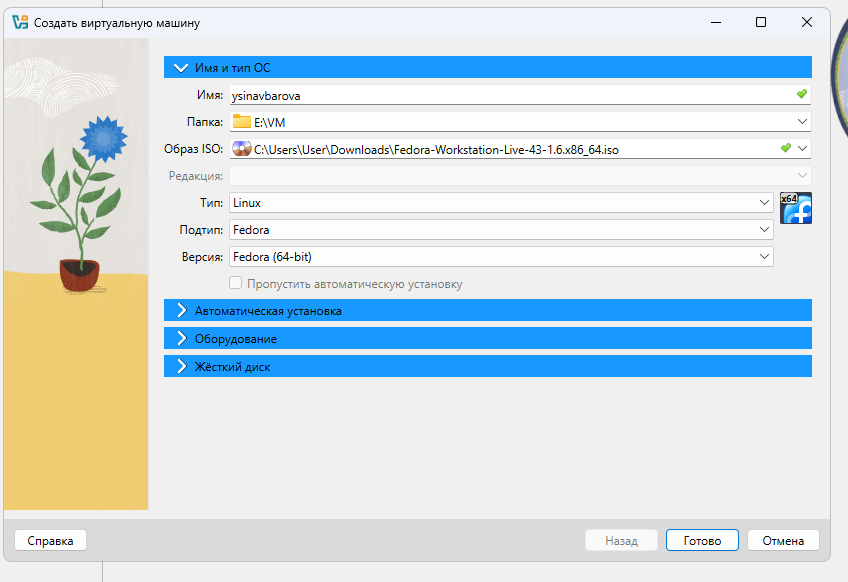
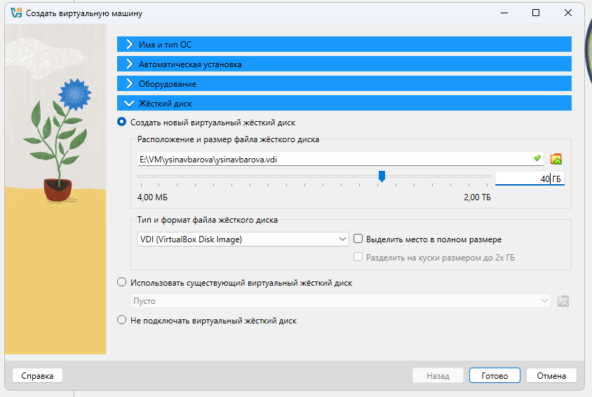
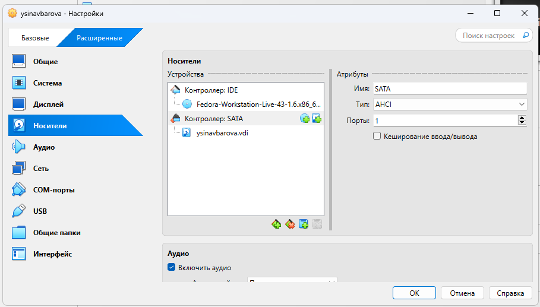
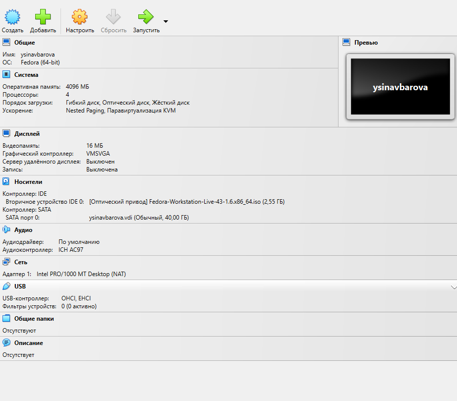
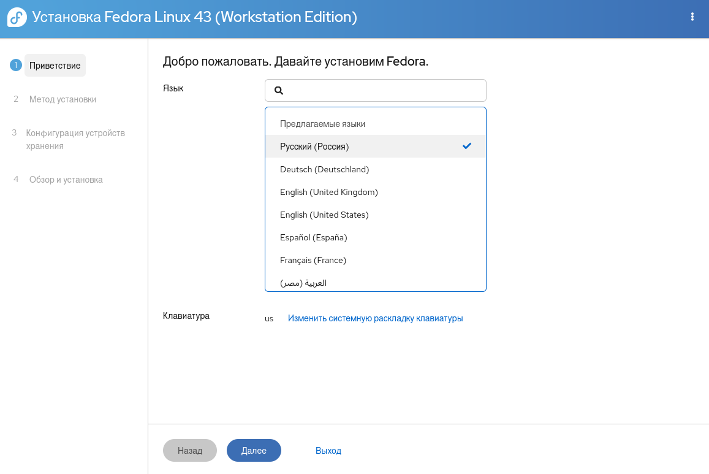
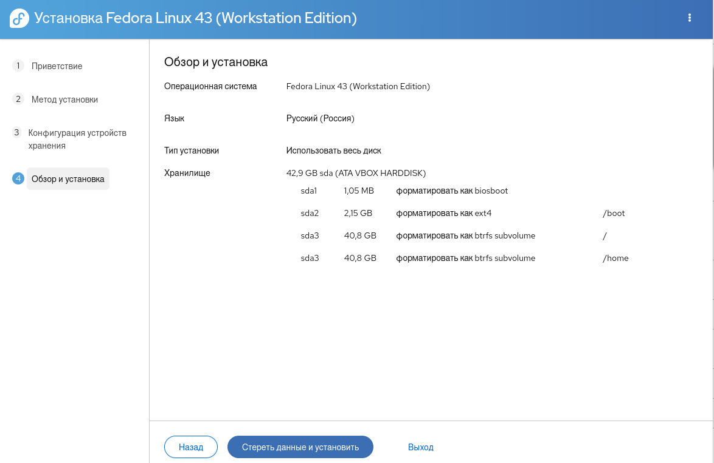
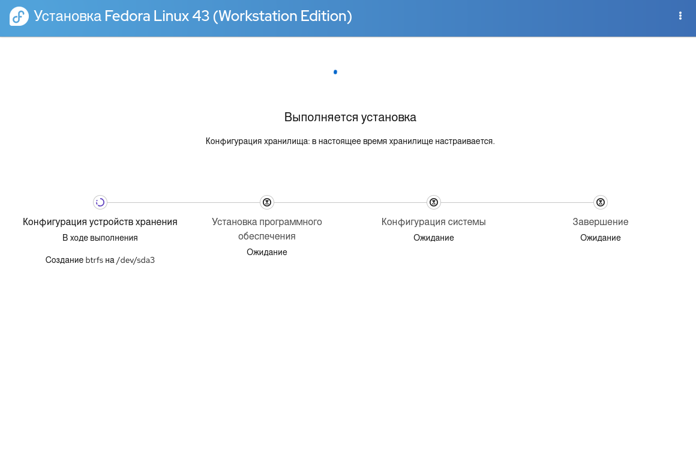
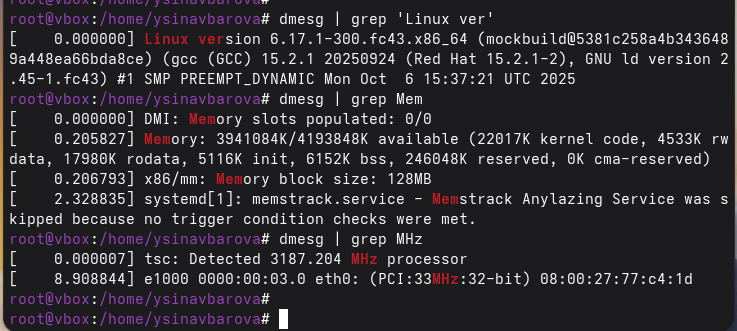
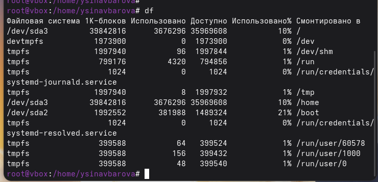

---
## Author
author:
  name: Синавбарова Ясмина Озодхоновна
  email: 1132250402@rudn.ru
  affiliation:
    - name: Российский университет дружбы народов
      country: Российская Федерация
      postal-code: 117198
      city: Москва
      address: ул. Миклухо-Маклая, д. 6
	  
## Title
title: Операционные системы
subtitle: Установка ОС на виртуальную машину
license: CC BY
date: today
date-format: "YYYY-MM-DD"
---

# Цели и задачи работы

## Цель лабораторной работы

Целью данной работы является приобретение практических навыков установки операционной системы на виртуальную машину, настройки минимально необходимых для дальнейшей работы сервисов

# Процесс выполнения лабораторной работы

## Создаю виртуальную машину

{ #fig:001 width=70% height=70% }

## Задаю конфигурацию жёсткого диска

{ #fig:002 width=70% height=70% }

## Задаю конфигурацию жёсткого диска

{ #fig:003 width=70% height=70% }

## Добавляю новый привод оптических дисков и выбираю образ 

{ #fig:004 width=70% height=70% }

## Установка языка

{ #fig:005 width=70% height=70% }

## Параметры установки

{ #fig:006 width=70% height=70% }

## Установка

{ #fig:007 width=70% height=70% }

## Создание пользователя

{ #fig:008 width=70% height=70% }

## Рабочая система

{ #fig:009 width=70% height=70% }

## Рабочая система

{ #fig:010 width=70% height=70% }

# Выводы по проделанной работе

## Вывод

Мы приобрели практические навыки установки операционной системы на виртуальную машину, настройки минимально необходимых для дальнейшей работы сервисов.