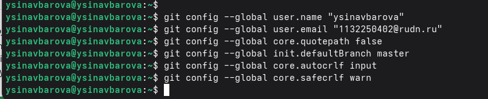
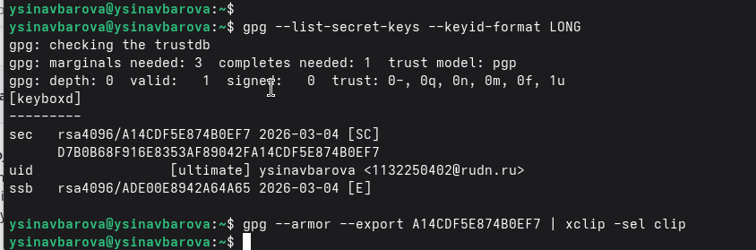
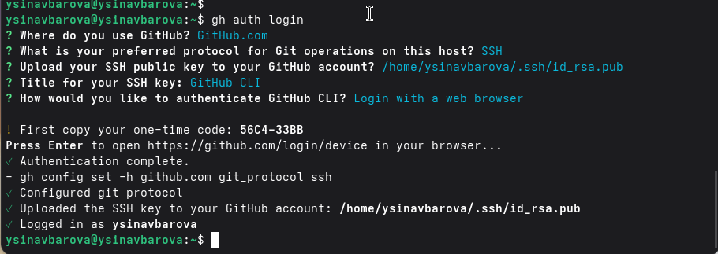
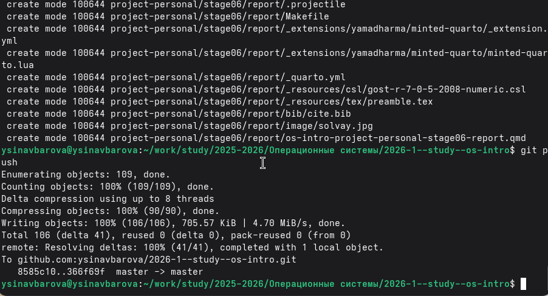

---
## Author
author:
  name: Синавбарова Ясмина Озодхоновна
  email: 1132250402@rudn.ru
  affiliation:
    - name: Российский университет дружбы народов
      country: Российская Федерация
      postal-code: 117198
      city: Москва
      address: ул. Миклухо-Маклая, д. 6
	  
## Title
title: Операционные системы
subtitle: Управление версиями
license: CC BY
date: today
date-format: "YYYY-MM-DD" # Example: 2025-09-06
---

# Цели и задачи работы

## Цель лабораторной работы

Целью данной работы является изучение идеологии и применения средств контроля версий и освоение умений работать с git.

# Процесс выполнения лабораторной работы

## Глобальные параметры репозитория

{ #fig:001 width=70% height=70% }

## Добавляем GPG ключ в аккаунт

{ #fig:002 width=70% height=70% }

## Настройка gh

{ #fig:003 width=70% height=70% }

## Подготовка репозитория

{ #fig:004 width=70% height=70% }

# Выводы по проделанной работе

## Вывод

Мы приобрели практические навыки работы с сервисом github.

