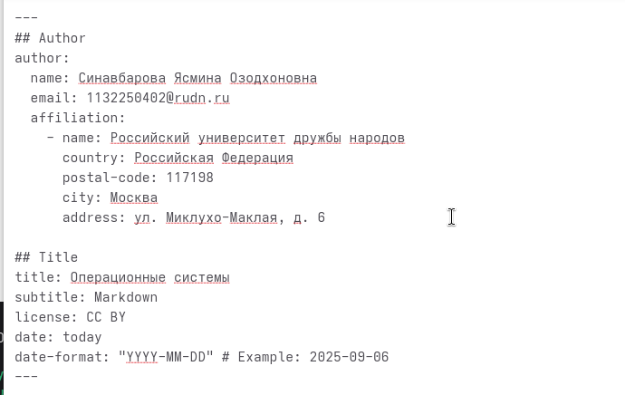
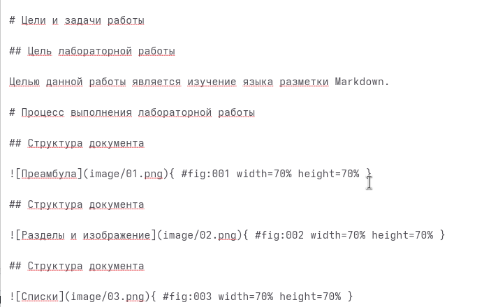
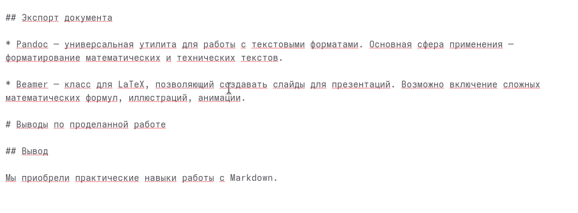

---
## Author
author:
  name: Синавбарова Ясмина Озодхоновна
  email: 1132250402@rudn.ru
  affiliation:
    - name: Российский университет дружбы народов
      country: Российская Федерация
      postal-code: 117198
      city: Москва
      address: ул. Миклухо-Маклая, д. 6
	  
## Title
title: Операционные системы
subtitle: Markdown
license: CC BY
date: today
date-format: "YYYY-MM-DD" # Example: 2025-09-06
---

# Цели и задачи работы

## Цель лабораторной работы

Целью данной работы является изучение языка разметки Markdown.

# Процесс выполнения лабораторной работы

## Структура документа

{ #fig:001 width=70% height=70% }

## Структура документа

{ #fig:002 width=70% height=70% }

## Структура документа

{ #fig:003 width=70% height=70% }

## Экспорт документа

* Pandoc — универсальная утилита для работы с текстовыми форматами. Основная сфера применения — форматирование математических и технических текстов.

* Beamer — класс для LaTeX, позволяющий создавать слайды для презентаций. Возможно включение сложных математических формул, иллюстраций, анимации.

# Выводы по проделанной работе

## Вывод

Мы приобрели практические навыки работы с Markdown.
