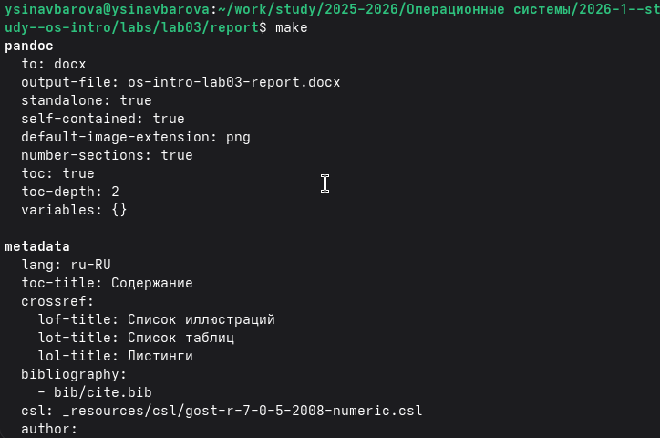
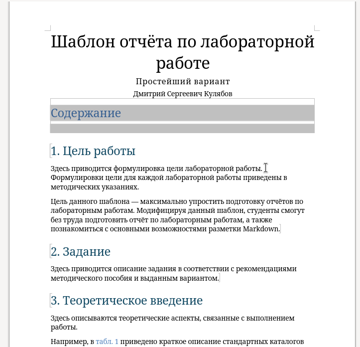
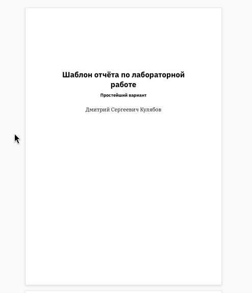
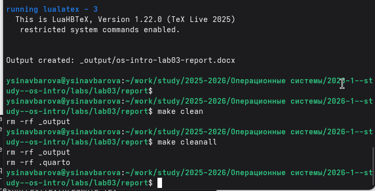
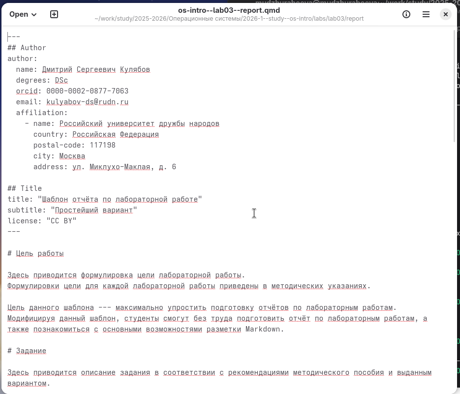
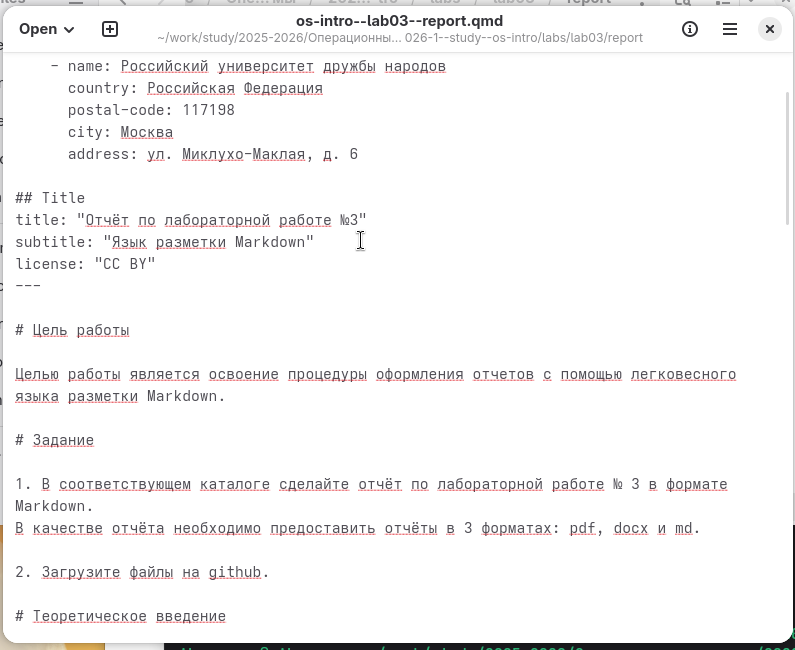
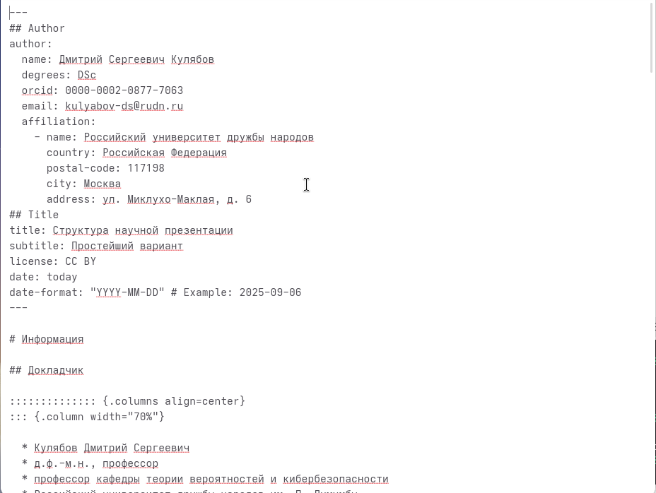
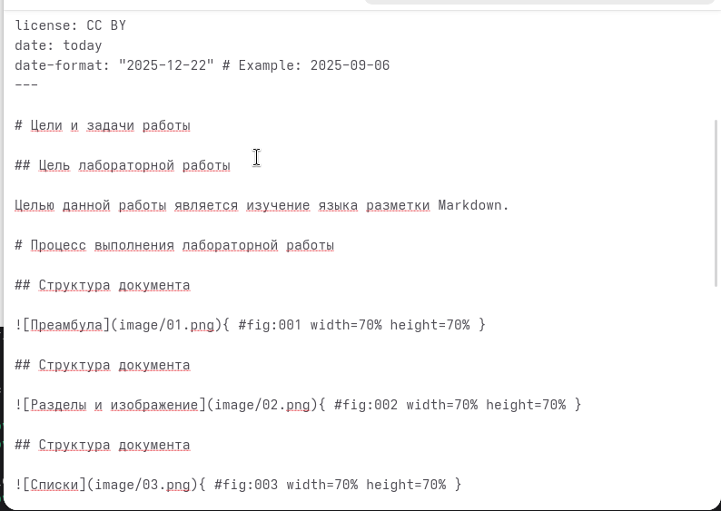

---
## Author
author:
  name: Синавбарова Ясмина Озодхоновна
  email: 1132250402@rudn.ru
  affiliation:
    - name: Российский университет дружбы народов
      country: Российская Федерация
      postal-code: 117198
      city: Москва
      address: ул. Миклухо-Маклая, д. 6

## Title
title: "Отчёт по лабораторной работе №3"
subtitle: "Язык разметки Markdown"
license: "CC BY"
---

# Цель работы

Целью работы является освоение процедуры оформления отчетов с помощью легковесного языка разметки Markdown.

# Задание

1. В соответствующем каталоге сделайте отчёт по лабораторной работе № 3 в формате Markdown. 
В качестве отчёта необходимо предоставить отчёты в 3 форматах: pdf, docx и md.

2. Загрузите файлы на github.

# Теоретическое введение

Маркдаун, он же markdown — удобный и быстрый способ разметки текста. 
Маркдаун используют, если недоступен HTML, а текст нужно сделать 
читаемым и хотя бы немного размеченным (заголовки, списки, картинки, ссылки).
Главный пример использования маркдауна, с которым мы часто сталкиваемся — файлы readme.md, 
которые есть в каждом репозитории на Гитхабе. 
md в имени файла это как раз сокращение от markdown.
Другой частый пример — сообщения в мессенджерах. Можно поставить звёздочки вокруг 
текста в Телеграме, и текст станет полужирным.

# Выполнение лабораторной работы

Установили программы pandoc и TexLive по указаниям в лабораторной работе. 

1. Откройте терминал

2. Перейдите в каталог курса сформированный при выполнении лабораторной работы №3:
Обновите локальный репозиторий, скачав изменения из удаленного репозитория.

3. Перейдите в каталог с шаблоном отчета по лабораторной работе № 3

4. Проведите компиляцию шаблона с использованием Makefile. 
Для этого введите команду make.
При успешной компиляции должны сгенерироваться файлы report.pdf и
report.docx. Откройте и проверьте корректность полученных файлов. (рис. [-@fig-001], [-@fig-002], [-@fig-003])

{ #fig-001 width=70%, height=70% }

{ #fig-002 width=70%, height=70% }

{ #fig-003 width=70%, height=70% }

5. Удалите полученный файлы с использованием Makefile. Для этого введитекоманду make clean
Проверьте, что после этой команды файлы report.pdf и report.docx были удалены. (рис. [-@fig-004])

{ #fig-004 width=70%, height=70% }

6. Откройте файл report.md c помощью любого текстового редактора, например gedit
Внимательно изучите структуру этого файла. (рис. [-@fig-005])

{ #fig-005 width=70%, height=70% }

{ #fig-006 width=70%, height=70% }

7. Заполните отчет и скомпилируйте отчет с использованием Makefile. 
Проверьте корректность полученных файлов. (рис. [-@fig-007], [-@fig-008])
(Обратите внимание, для корректного отображения скриншотов они должны быть размещены в каталоге image)

{ #fig-007 width=70%, height=70% }

{ #fig-008 width=70%, height=70% }

8. Загрузите файлы на Github.

# Выводы

Изучили синтаксис языка разметки Markdown, получили отчет из шаблона при помощи Makefile. 
