---
## Author
author:
  name: Синавбарова Ясмина Озодхоновна
  email: 1132250402@rudn.ru
  affiliation:
    - name: Российский университет дружбы народов
      country: Российская Федерация
      postal-code: 117198
      city: Москва
      address: ул. Миклухо-Маклая, д. 6

## Title
title: "Отчёт по лабораторной работе №4"
subtitle: "Продвинутое использование git"
license: "CC BY"
---

# Цель работы

Получение навыков правильной работы с репозиториями git.

# Теоретические сведения

* Gitflow Workflow опубликована и популяризована Винсентом Дриссеном.

* Gitflow Workflow предполагает выстраивание строгой модели ветвления с учётом выпуска проекта.

* Данная модель отлично подходит для организации рабочего процесса на основе релизов.

* Работа по модели Gitflow включает создание отдельной ветки для исправлений ошибок в рабочей среде.

* Последовательность действий при работе по модели Gitflow:

* Из ветки master создаётся ветка develop.

* Из ветки develop создаётся ветка release.

* Из ветки develop создаются ветки feature.

* Когда работа над веткой feature завершена, она сливается с веткой develop.

* Когда работа над веткой релиза release завершена, она сливается в ветки develop и master.

* Если в master обнаружена проблема, из master создаётся ветка hotfix.

* Когда работа над веткой исправления hotfix завершена, она сливается в ветки develop и master.

# Выполнение лабораторной работы

## Работа с тестовым репозиторием

Для работы с Node.js добавим каталог с исполняемыми файлами, 
устанавливаемыми yarn, в переменную PATH.

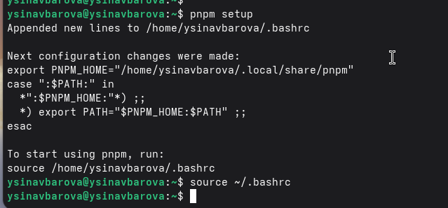{ #fig:001 width=70% height=70% }

Программа commitizen используется для помощи в форматировании коммитов.
При этом устанавливается скрипт git-cz, который мы и будем использовать для коммитов.

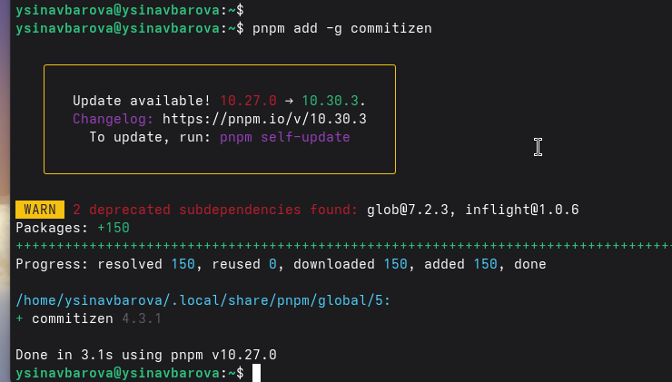{ #fig:002 width=70% height=70% }

Программа standard-changelog используется для помощи в создании логов.

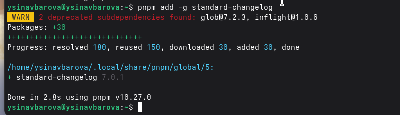{ #fig:003 width=70% height=70% }

Делаем первый коммит и выкладываем на github.

Необходимо заполнить несколько параметров пакета.

Таким образом, файл package.json приобретает вид:

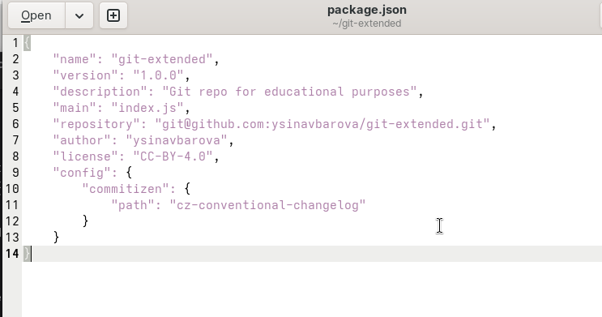{ #fig:004 width=70% height=70% }

Добавим новые файлы.

Выполним коммит.

Отправим на github.

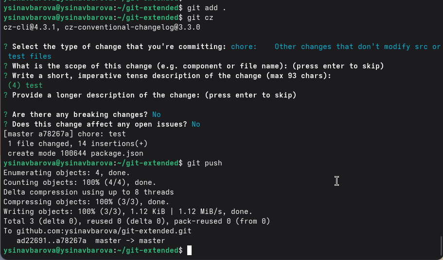{ #fig:005 width=70% height=70% }

Инициализируем git-flow

Проверьте, что Вы на ветке develop

Загрузите весь репозиторий в хранилище

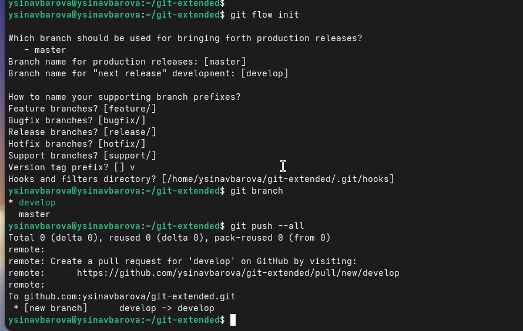{ #fig:006 width=70% height=70% }

Установите внешнюю ветку как вышестоящую для этой ветки

Создадим релиз с версией 1.0.0

Создадим журнал изменений

Добавим журнал изменений в индекс

Зальём релизную ветку в основную ветку

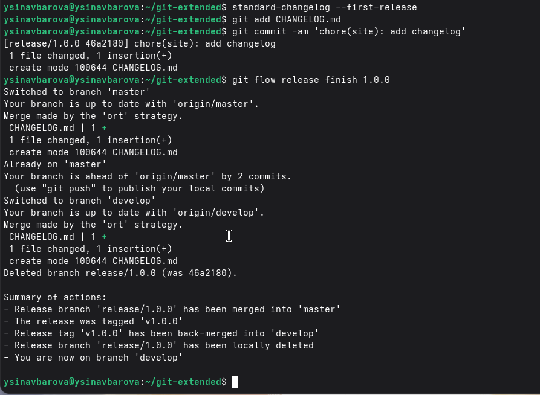{ #fig:007 width=70% height=70% }

Отправим данные на github

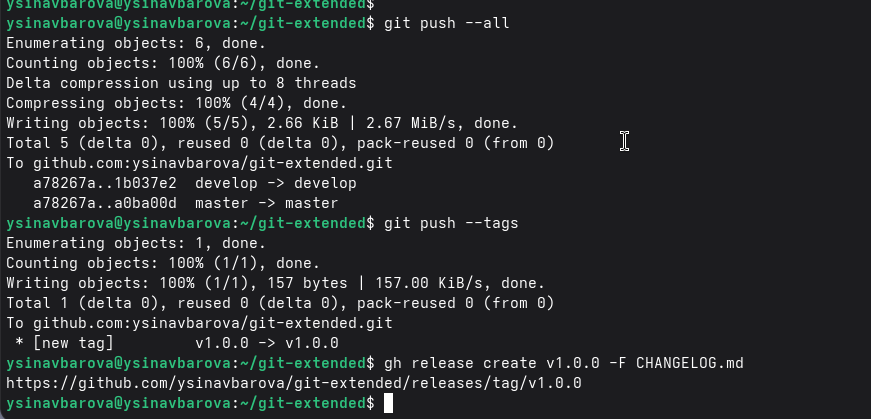{ #fig:008 width=70% height=70% }

Создадим ветку для новой функциональности
По окончании разработки новой функциональности следующим шагом следует объединить ветку feature_branch c develop:

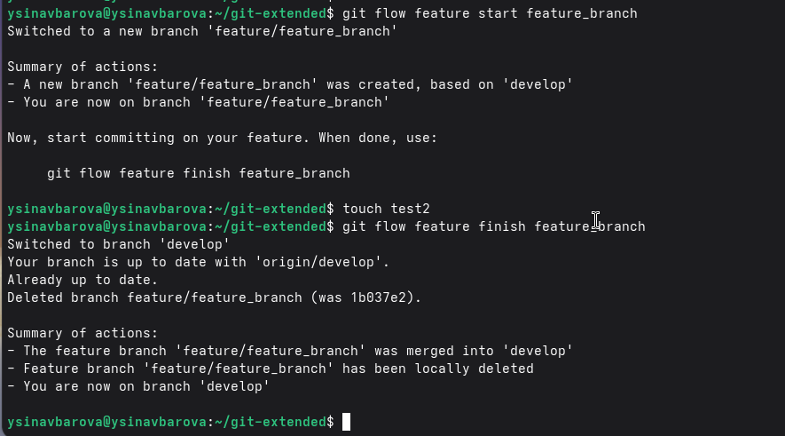{ #fig:009 width=70% height=70% }

Создадим релиз с версией 1.2.3

Обновите номер версии в файле package.json. Установите её в 1.2.3

Создадим журнал изменений

Добавим журнал изменений в индекс

Зальём релизную ветку в основную ветку

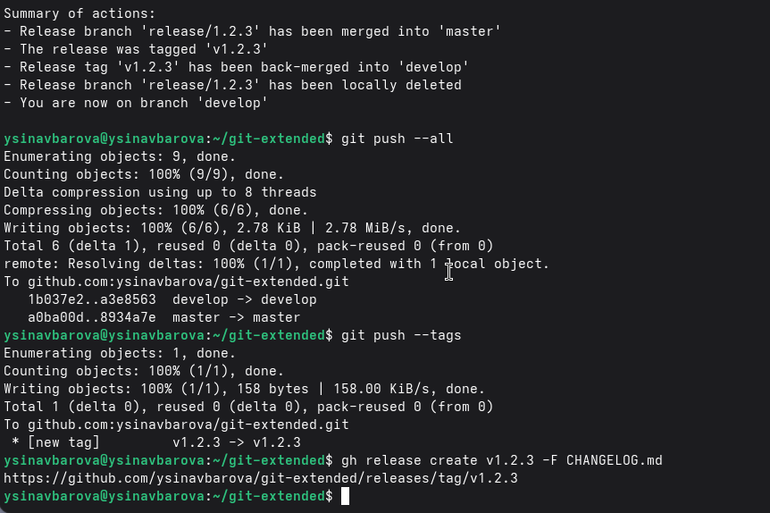{ #fig:010 width=70% height=70% }

## Подготовка рабочего репозитория

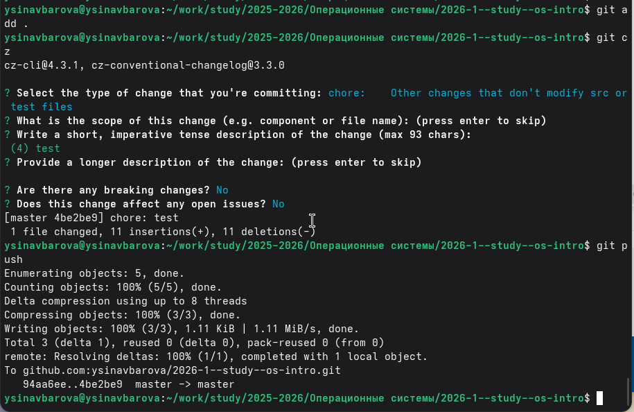{ #fig:011 width=70% height=70% }

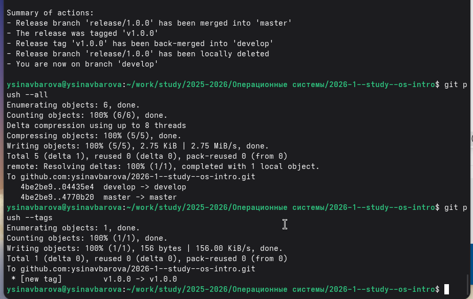{ #fig:012 width=70% height=70% }

# Вывод

Мы приобрели практические навыки взаимодействия с дополнительными функциями гитхаб.
